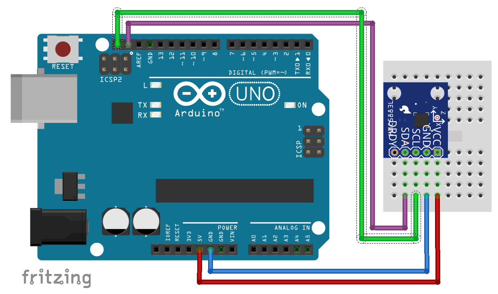

# GY-273 Library

#Example

##Wiring


##Code
```c
#include <GY273.h>

int x, y, z;

void setup()
{
        Serial.begin(9600);
        if (!GY273Setup())
        {
                Serial.println("failed to setup GY-273");
                while (1); //shotdown the program
        }
}

void loop()
{
        GY273Read(GY273_X, &x);
        GY273Read(GY273_Y, &y);
        GY273Read(GY273_Z, &z);
        Serial.print("x=");
        Serial.print(x, DEC);
        Serial.print(" ");
        Serial.print("y=");
        Serial.print(y, DEC);
        Serial.print(" ");
        Serial.print("z=");
        Serial.print(z, DEC);
        Serial.println();
        delay(60);
}
```
